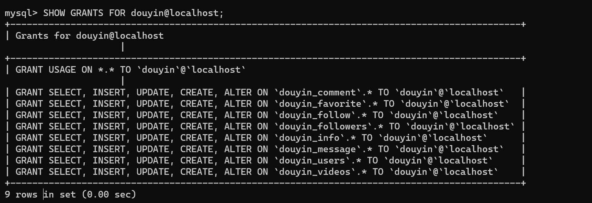

# 特别注意

所有的默认数据库文件请使用root用户打开

```mysql
source 文件地址;
```

# 文件作用

1. douyin_info 基本信息数据库，保存了每个用户，视频得基本信息（主要的就是用户的账号密码，用户的基本信息，视频的基本信息）
2. douyin_followers 关注者数据库，针对每个用户进行分表，记录了每一个用户的关注者，主键是关注者的id
3. douyin_users 每个用户的发布视频的分表，保存了每个用户发布的视频，主键是用户发布视频的id
4. douyin_videos 每个视频的点赞信息，对每一个视频进行分表，记录了每一个视频中点赞用户的id，主键是点赞的用户id
5. douyin_favorite 每个用户的点赞视频的id，对每一个用户进行分表，记录了用户点赞的视频的id，主键是点赞用户的id
6. douyin_comment每个视频下的用户评论，以评论的id为主键，id的排序依照时间顺序，所以id可以代替时间戳使用
7. douyin_message用户的信息数据，以信息的id为主键，每次进行信息数据库的维护都是同时对收发双方进行维护的
8. douyin_follow用户的关注列表，主键是用户关注的人的id

# 新建数据库以及数据库授权

 在mysql中
首先登录root

```mysql
mysql -u root -p
```

然后创建新用户

```mysql
create user douyin@localhost identified by '123456';
```

创建了douyin这个用户，密码是123456

```mysql
select user,host from mysql.user;
```

查看用户列表中是否有douyin这个用户
然后创建数据库

```mysql

#创建douyin_info数据库
create database douyin_info;
#创建douyin_users数据库
create database douyin_users;
#创建douyin_videos数据库
create database douyin_videos;
#创建douyin_followers数据库
create database douyin_followers;
#创建douyin_favorite数据库
create database douyin_favorite;
#创建douyin_favorite数据库
create database douyin_comment;
#创建douyin_message数据库
create database douyin_message;
#创建douyin_folllow数据库
create database douyin_follow;
```

为douyin这个用户授予创建库和表，修改，插入，查找的权限（不授予删除权限是怕其被sql注入之后乱删东西，确保安全）

```mysql
GRANT CREATE,ALTER,INSERT,SELECT,UPDATE ON douyin_info.* TO douyin@localhost;
GRANT CREATE,ALTER,INSERT,SELECT,UPDATE ON douyin_users.* to douyin@localhost;
GRANT CREATE,ALTER,INSERT,SELECT,UPDATE ON douyin_videos.* to douyin@localhost;
GRANT CREATE,ALTER,INSERT,SELECT,UPDATE ON douyin_followers.* TO douyin@localhost;
GRANT CREATE,ALTER,INSERT,SELECT,UPDATE ON douyin_favorite.* TO douyin@localhost;
GRANT CREATE,ALTER,INSERT,SELECT,UPDATE ON douyin_comment.* TO douyin@localhost;
GRANT CREATE,ALTER,INSERT,SELECT,UPDATE ON douyin_message.* TO douyin@localhost;
douyin@localhost;
GRANT CREATE,ALTER,INSERT,SELECT,UPDATE ON douyin_follow.* TO douyin@localhost;
```

这样一个名为douyin的用户就创建好了，接下来可以使用其进行测试

```mysql
mysql -u douyin -p
#确认库
show databases;
#显示权限
SHOW GRANTS FOR douyin@localhost;
```

展示用户权限之后即可


大功告成
